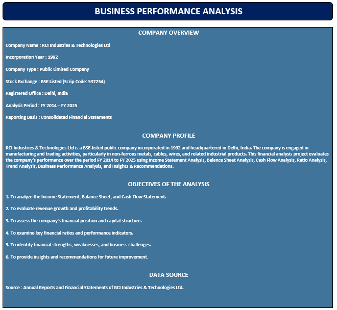
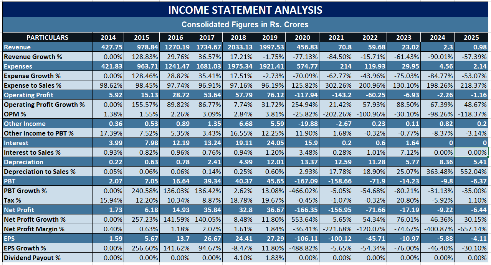
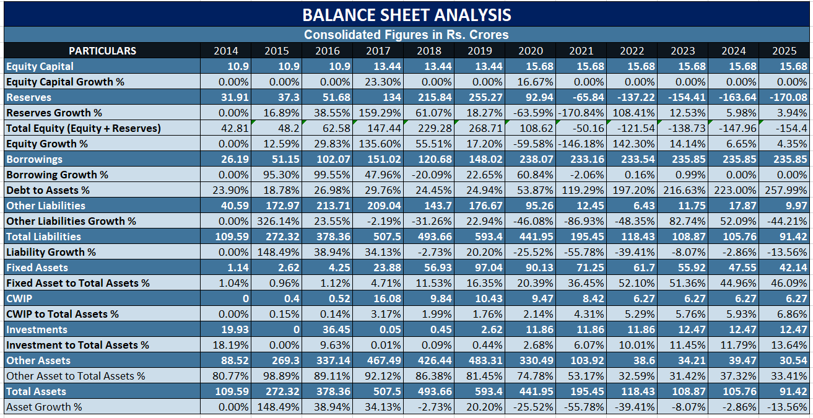
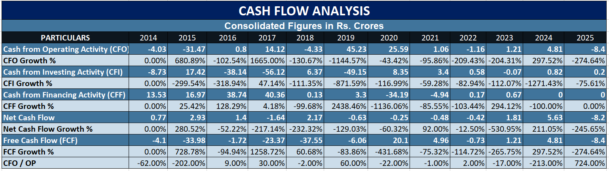
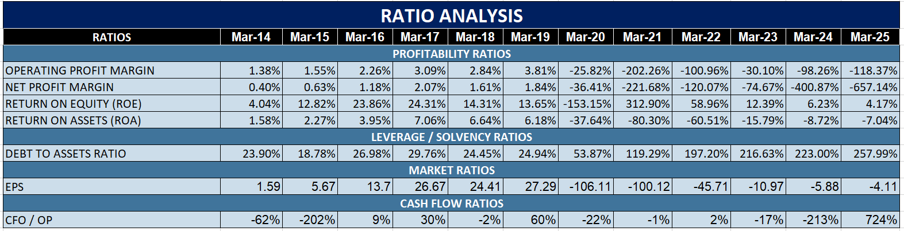

# RCI Industries – Financial Statement Analysis (2014–2025)

## Project Overview

This project presents an annual financial statement analysis of RCI Industries & Technologies Ltd. covering the period from 2014 to 2025.

The analysis was conducted using Microsoft Excel to examine financial performance, trends, and key financial indicators over multiple years.

## Objectives

- Analyse historical financial performance
- Identify revenue and profitability trends
- Evaluate changes in key financial statement items
- Perform year-over-year and trend analysis
- Calculate and interpret key financial ratios
- Develop a structured financial reporting workbook

## Analysis Performed

- Income Statement Analysis
- Balance Sheet Analysis
- Revenue Trend Analysis
- Profitability Analysis
- Ratio Analysis
- Year-over-Year Analysis
- Trend Analysis
- Financial Performance Comparison

## Tools & Skills

- Microsoft Excel
- Financial Analysis
- Financial Statement Analysis
- Financial Reporting
- Ratio Analysis
- Trend Analysis
- Data Analysis
- Data Interpretation
- Spreadsheet Management

## Project Period

2014–2025

## Deliverable

The complete Excel workbook is included in this repository:

`RCI_Industries_Financial_Statement_Analysis_2014_2025.xlsx`

## Disclaimer
## Project Screenshots

### Annual Financial Statement Analysis

### Income Statement Analysis

### Balance Sheet Analysis

### Cash Flow Analysis

### Ratio Analysis

This project is created for educational and portfolio purposes using publicly available company information. It is not intended as investment advice or a professional financial recommendation.
